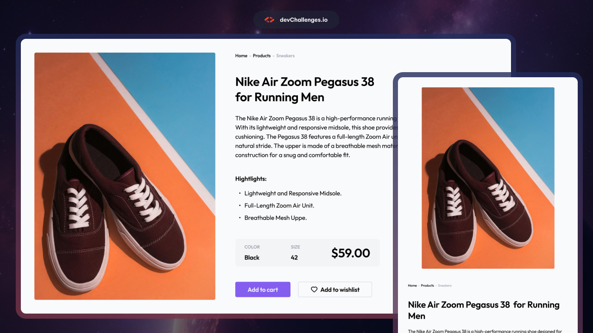

# DevChallenges.io - Shoe Product Page

## Welcome! 👋

Welcome to this responsive web coding challenge.

[devChallenges.io](https://devchallenges.io/) challenges are designed to help you enhance your coding skills by building realistic projects.

**Suggested Skills to practice: HTML and CSS**

## The challenge

Your task is to create a web page that closely resembles the provided design.

<!-- Please update value in the {}  -->

<h1 align="center">Testimonial Page | devChallenges</h1>

   Solution for a challenge <a href="https://devchallenges.io/challenge/testimonial-page" target="_blank">Testimonial Page</a> from <a href="http://devchallenges.io" target="_blank">devChallenges.io</a>.

  <h3>
    <a href="https://product-listing-dev.netlify.app/">
      Demo
    </a>
     | 
    <a href="https://product-listing-dev.netlify.app/">
      Solution
    </a>
     | 
    <a href="https://devchallenges.io/challenge/testimonial-page">
      Challenge
    </a>
  </h3>

<!-- TABLE OF CONTENTS -->

## Table of Contents

- [Screenshot](#Screenshot)
- [Built with](#built-with)
- [Acknowledgements](#acknowledgements)

<!-- OVERVIEW -->

## Screenshot

### Built with

- Semantic HTML5 markup
- CSS custom properties
- Flexbox

## Features
This application/site was created as a submission to a [DevChallenges](https://devchallenges.io/challenges-dashboard) challenge.

## Author

Paul Davidson
# TestimonalPage
